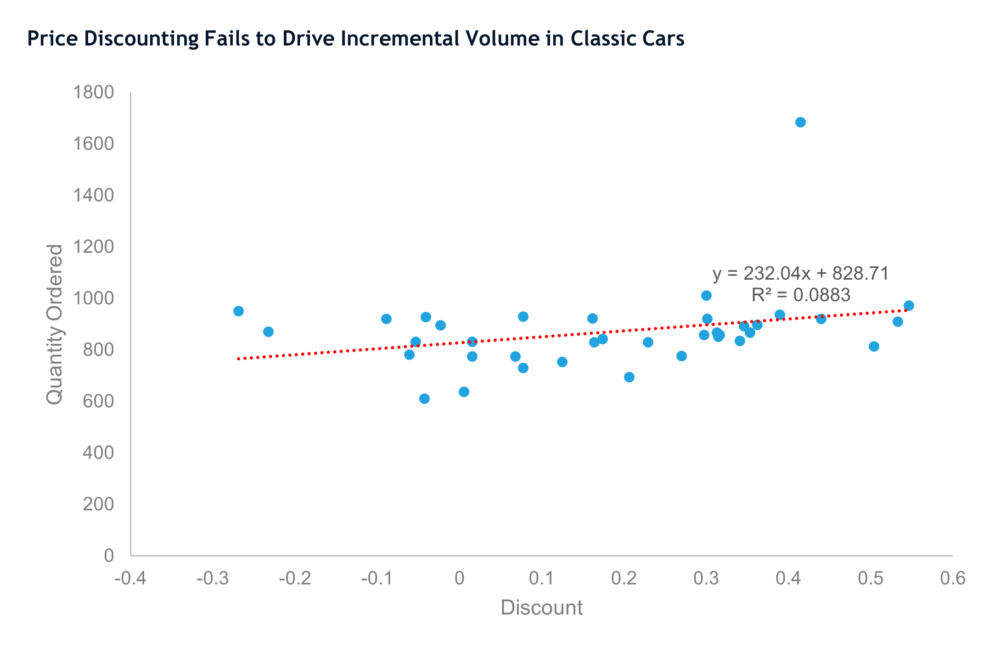

  

<h1 align="center">B2B Sales Performance Analysis Report</h1>
<table align="center">
  <tr>
    <td width="1440">
      <h2 align="center">Project Background</h2>
      <body>
        <strong>B2B Sales Performance Analysis</strong> is a comprehensive portfolio project using Microsoft Excel, presented by Sinta M. Rohmah. The project evaluates the end-to-end operational cycle of international wholesale, tracking macro-performance from order placement to fund disbursement. 
         
        The company operates in a high-ticket B2B wholesale sector, generating total overall revenue exceeding <strong>$9.44 million</strong> across 290 successful orders from 92 unique business clients. The available data covers multiple dimensions including financial metrics, operational/fulfillment efficiency, and B2B client distribution. 
         An in-depth analysis was conducted to evaluate performance over the 2003–2005 period. This review provides insights to pinpoint profit leakages, assess operational bottlenecks, and drive strategic solutions. The key insights and recommendations focus on the following areas:
      </body>
      <h3>Metrics & Methodology</h3>
      <h4>
        <ul>
          <li>Methodology steps - Covering business process mapping, key KPI definition, data review, business issue identification, and strategic recommendations.</li>
          <li>Business performance metrics - Tracking total realized revenue, price realization rate, monthly revenue, and revenue at risk.</li>
          <li>Operational & fulfillment KPIs - Monitoring shipped rate, cancellation rate, and order line volume.</li>
          <li>B2B client indicators - Evaluating Average Order Value (AOV), order frequency, deal size distribution, and customer concentration.</li>
        </ul>
      </h4>
    </td>
  </tr>
</table>

<h1 align="center">Executive Summary</h1>
<h3 align="center">Overall Performance & Key Findings (2003–2005)</h3>
<table align="center" width="100%">
  <tr>
    <td align="center" width="14.2%" style="border: 1px solid #ddd; padding: 10px;">
      <strong>Total Revenue</strong>  
      $9,442,219
    </td>
    <td align="center" width="14.2%" style="border: 1px solid #ddd; padding: 10px;">
      <strong>Customers Unique</strong>  
      92
    </td>
    <td align="center" width="14.2%" style="border: 1px solid #ddd; padding: 10px;">
      <strong>Total Order Success</strong>  
      290
    </td>
    <td align="center" width="14.2%" style="border: 1px solid #ddd; padding: 10px;">
      <strong>Fulfillment Rate</strong>  
      93.16%
    </td>
    <td align="center" width="14.2%" style="border: 1px solid #ddd; padding: 10px;">
      <strong>SKU Sold</strong>  
      99,067
    </td>
    <td align="center" width="14.2%" style="border: 1px solid #ddd; padding: 10px;">
      <strong>Cancellation Rate</strong>  
      1.30%
    </td>
    <td align="center" width="14.2%" style="border: 1px solid #ddd; padding: 10px;">
      <strong>Avg. Order Value</strong>  
      $32,559
    </td>
  </tr>
</table>

<table align="center">
  <tr>
    <td width="460" valign="top">
      <ol>
        <li>
          <strong>High-Ticket Wholesale Characteristics:</strong>
          <ul>
            <li>Operates with low transaction frequency but high value volume, achieving an overall AOV of $32,559 per transaction.</li>
            <li>Generated $9,442,219 in total revenue through the export of 99,067 SKU units across 19 different countries.</li>
            <li>Maintained a healthy fulfillment rate of 93.16%, leaving only a minor 1.30% cancellation rate.</li>
          </ul>
        </li>
        <li>
          <strong>Product Line Dominance:</strong>
          <ul>
            <li>Classic Cars serves as the primary revenue driver, contributing nearly 40% ($3.72M) of total company revenue and leading in volume.</li>
            <li>Only 6 of the top-selling SKUs also rank among the top revenue contributors.</li>
            <li>S18_3232 stands out as the top SKU, capturing 1.81% of total units sold and 2.91% of total revenue.</li>
          </ul>
        </li>
      </ol>
    </td>
    <td width="460" valign="top">
      <ol start="3">
        <li>
          <strong>Customer Concentration & Behavior:</strong>
          <ul>
            <li>Faces moderate-to-high concentration risk where roughly 40% of customers (top 32) drive 60% of total revenue.</li>
            <li>Top two clients (Euro Shopping Channel and Mini Gifts Distributors Ltd.) drive revenue primarily through high order frequency.</li>
            <li>EMEA and North America hold 89% of all customers and dominate top revenue contributions.</li>
          </ul>
        </li>
        <li>
          <strong>Pricing & Operational Risks:</strong>
          <ul>
            <li>70.14% of all units are sold below MSRP, with Classic Cars alone driving 28% of that discounted volume.</li>
            <li>Price discounting below MSRP fails to drive incremental volume in Classic Cars, explaining only 8.8% of order variation.</li>
            <li>EMEA accounts for 77.6% of all lost revenue, traced primarily to a single fulfillment event in June 2004.</li>
          </ul>
        </li>
      </ol>
    </td>
  </tr>
</table>

<h1 align="center">Insights Deep-Dive</h1>
<table>
  <tr>
    <td>
      <strong>Product Line Demand & SKU Performance</strong>
      <ol>
        <li>Classic Cars Dominance <ul>
            <li>Classic Cars generated $3,727,560 in realized revenue (39.8% of total) with 32,249 units ordered.</li>
            <li>Leads all product lines with an Average Order Value (AOV) of $19,723.</li>
          </ul>
        </li>
        <li>SKU Sales vs. Revenue Disconnect <ul>
            <li>Out of top-selling SKUs, only 6 also rank among top revenue contributors.</li>
            <li>S18_3232 leads in both volume (1.81%) and revenue contribution (2.91%).</li>
          </ul>
        </li>
      </ol>
      <strong>Customer Concentration & Purchasing Patterns</strong>
      <ol>
        <li>Revenue Concentration Risk <ul>
            <li>Top 32 customers (~40% of the 92 total base) account for 60% of total revenue.</li>
            <li>Euro Shopping Channel leads with $795,328 (8.42% of revenue) achieved through 23 frequent orders.</li>
          </ul>
        </li>
        <li>Dual Paths to High Revenue <ul>
            <li>Top tier clients scale via high order frequency, whereas mid-tier clients like AV Stores generate high AOV ($52,603) via fewer orders.</li>
            <li>EMEA (44) and North America (38) account for 89% of the total customer base.</li>
          </ul>
        </li>
      </ol>
      <strong>Order Fulfillment & Status Distribution</strong>
      <ol>
        <li>Healthy Core Operations <ul>
            <li>93.16% of platform orders are successfully shipped.</li>
            <li>Confirmed failures (cancelled/disputed) represent a small fraction at 2.28%.</li>
          </ul>
        </li>
        <li>Isolated Issues <ul>
            <li>Confirmed failures concentrate in Euro Shopping Channel and Danish Wholesale Imports.</li>
            <li>North America holds 85% of On Hold revenue ($152,719) across 3 separate customers with isolated administrative causes.</li>
          </ul>
        </li>
      </ol>
    </td>
  </tr>
</table>

<h1 align="center">Pricing Strategy & Discount Analysis</h1>
<table align="center">
  <tr>
    <td align="center" valign="top" width="50%">
      <h3>Classic Cars Discount Level vs. Order Volume</h3>
      
    </td>
    <td align="center" valign="top" width="50%">
      <h3>Structure of Below MSRP Sales & Realization</h3>
      
    </td>
  </tr>
</table>

<table align="center">
  <tr>
      <td width="333" valign="top">
      <h3>Below MSRP Reliance</h3>
      <ul>
        <li>70.14% of all units sold are priced below MSRP, revealing a heavy structural reliance on discounts rather than sporadic promotions.</li>
        <li>Classic Cars alone drives roughly 28% of total volume under MSRP, creating an inverted pattern where the top revenue line is heavily discounted.</li>
      </ul>
      </td>
  <td width="333" valign="top">
      <h3>Ineffectiveness of Discounting</h3>
      <ul>
        <li>Discount level explains only 8.8% of order volume variation in Classic Cars ($R^2 = 0.0883$).</li>
        <li>Average order quantity remains flat across High (35.45), Medium (34.38), and Low (34.67) discount groups—a spread of under 3%.</li>
      </ul>
      </td>
      <td width="333" valign="top">
      <h3>Margin Leakage</h3>
      <ul>
        <li>Giving high discounts buys no meaningful volume gain over low discounts.</li>
        <li>Every dollar discounted on Classic Cars beyond minimum deal requirements represents pure margin leakage.</li>
      </ul>
      </td>
  </tr>
</table>
<table align="center">
  <h1 align="center">Top 10 Customers Overview</h1>
  <tr>
    <td align="center" valign="top">
      <h3>Top Customers Profile & Purchasing Behavior</h3>
      <table>
        <thead>
          <tr>
            <th>Customer Name</th>
            <th>Revenue ($)</th>
            <th>% Revenue</th>
            <th>Avg. Order Value</th>
            <th>Order Frequency</th>
          </tr>
        </thead>
        <tbody>
          <tr>
            <td>Euro Shopping Channel</td>
            <td>$795,328</td>
            <td>8.42%</td>
            <td>$34,579</td>
            <td>23</td>
          </tr>
          <tr>
            <td>Mini Gifts Distributors Ltd.</td>
            <td>$647,596</td>
            <td>6.86%</td>
            <td>$40,475</td>
            <td>16</td>
          </tr>
          <tr>
            <td>Australian Collectors, Co.</td>
            <td>$200,995</td>
            <td>2.13%</td>
            <td>$40,199</td>
            <td>5</td>
          </tr>
          <tr>
            <td>Muscle Machine Inc</td>
            <td>$197,737</td>
            <td>2.09%</td>
            <td>$49,434</td>
            <td>4</td>
          </tr>
          <tr>
            <td>Dragon Souveniers, Ltd.</td>
            <td>$172,990</td>
            <td>1.83%</td>
            <td>$34,598</td>
            <td>5</td>
          </tr>
          <tr>
            <td>AV Stores, Co.</td>
            <td>$157,808</td>
            <td>1.67%</td>
            <td>$52,603</td>
            <td>3</td>
          </tr>
          <tr>
            <td>Anna's Decorations, Ltd</td>
            <td>$153,996</td>
            <td>1.63%</td>
            <td>$38,499</td>
            <td>4</td>
          </tr>
          <tr>
            <td>Corporate Gift Ideas Co.</td>
            <td>$149,883</td>
            <td>1.59%</td>
            <td>$37,471</td>
            <td>4</td>
          </tr>
          <tr>
            <td>Salzburg Collectables</td>
            <td>$149,799</td>
            <td>1.59%</td>
            <td>$37,450</td>
            <td>4</td>
          </tr>
          <tr>
            <td>Saveley & Henriot, Co.</td>
            <td>$142,874</td>
            <td>1.51%</td>
            <td>$47,625</td>
            <td>3</td>
          </tr>
        </tbody>
      </table>
    </td>
  </tr>
</table>
<table>
  <tr>
    <td>
      <ul>
        <li>The top 10 customers collectively contribute 29.3% of total company revenue.</li>
        <li>Euro Shopping Channel leads through maximum order frequency (23 orders) despite having an AOV below the top 10 median.</li>
        <li>AV Stores achieves the highest AOV ($52,603) among the group with only 3 orders, ranking 6th overall.</li>
        <li>Repeat customer analysis surfaces 4 additional accounts (Reims Collectables, Danish Wholesale Imports, Blauer See Auto Co., and Baane Mini Imports) that represent frequent, low-value orders invisible in top revenue lists.</li>
      </ul>
    </td>
  </tr>
</table>
<table align="center">
  <h1 align="center">Revenue Loss & Recovery Potential</h1>
  <tr>
    <td align="center" valign="top" width="50%">
      <h3>Lost Revenue by Customer & Products</h3>
      
    </td>
    <td align="center" valign="top" width="50%">
      <h3>Revenue Recovery Potential</h3>
      
    </td>
  </tr>
  <tr>
    <td colspan="2">
      <ul>
        <li>EMEA accounts for 77.6% of total revenue lost to cancelled or disputed orders, dwarfing North America (17.01%) and APAC (5.39%).</li>
        <li>Losses are highly concentrated: UK Collectables alone accounts for over $50K in lost revenue from a single product category (Classic Cars).</li>
        <li>Root cause investigation revealed that the June 2004 revenue dip in EMEA stemmed from a single fulfillment batch affecting multiple SKUs across unrelated accounts, indicating shipping/supplier issues rather than product defects.</li>
        <li>Resolving pending accounts like The Sharp Gifts Warehouse's on-hold order ($57,883) can immediately boost account revenue by 57%.</li>
      </ul>
    </td>
  </tr>
</table>
<h1 align="center">Business Questions Addressed</h1>
<table align="center">
  <tr valign="top">
     <td width="900">
      <ul>
        <li><strong>Territory Loss Attribution:</strong> EMEA accounts for 77.6% of losses, heavily concentrated in just 4 accounts driven by a June 2004 fulfillment batch anomaly.</li>
        <li><strong>SKU vs. Operational Failure:</strong> Failures are not SKU-specific; 429 units canceled by UK Collectables spanned 13+ SKUs from a single order timeline.</li>
        <li><strong>Revenue at Risk & Recovery:</strong> North America holds 85% of On Hold revenue ($152,719) across 3 isolated customers, representing clear administrative recovery targets.</li>
        <li><strong>Discount Elasticity:</strong> Price discounting fails to drive volume ($R^2 = 0.0883$), confirming excessive discounting on Classic Cars causes pure margin leakage rather than growth.</li>
      </ul>
    </td>
  </tr>
</table>
<table align="center">
    <h1>Recommendations</h1>
    <h4>Based on financial and operational insights, here are actionable items for management.</h4>
      <ul>
        <h3>EMEA Revenue Loss (June 2004)</h3>
        <li>Conduct a specific audit of the shipping and supplier processes for June 2004 and replicate preventive checks for similar operational windows.</li>
          <ul><li>Root cause analysis proved failures across UK Collectables and Euro Shopping Channel resulted from fulfillment bottlenecks, not product defects.</li></ul>
        <h3>North America On Hold Revenue</h3>
        <li>Speed up document resolution and credit check procedures for North American accounts holding $152,719 in pending revenue.</li>
          <ul><li>Because holds span isolated timeframes across separate accounts, fixing administrative workflow bottlenecks will rapidly unblock revenue.</li></ul>
        <h3>Classic Cars Discount Policy</h3>
        <li>Conduct a controlled price test (A/B testing) on Classic Cars to reevaluate discount sensitivity before implementing a permanent policy shift.</li>
          <ul><li>Given that discount levels explain only 8.8% of volume variation, removing excess discounts will protect operating margins.</li></ul>
        <h3>Structural Dependence on Pricing Below MSRP</h3>
        <li>Re-evaluate net profit margins on Classic Cars to prevent high volume turnover from eroding bottom-line profitability through excessive discounting.</li>
          <ul><li>Ensure discounting aligns strictly with minimum requirements needed to close enterprise wholesale deals.</li></ul>
      </ul>
</table>
